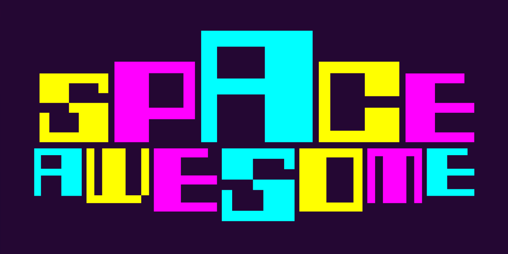
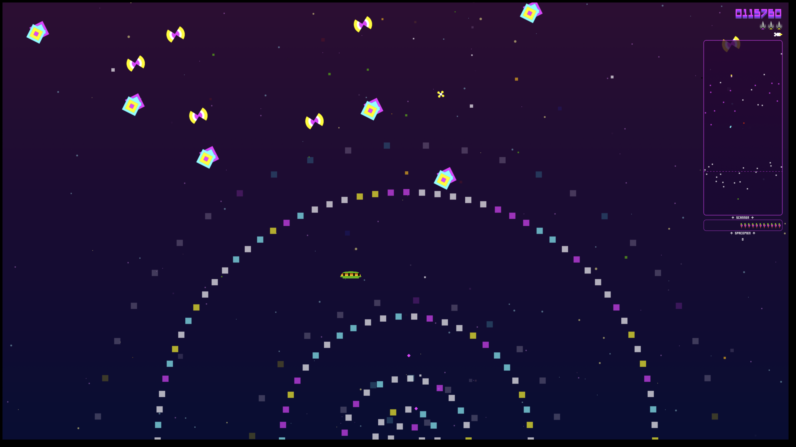

# SPACE AWESOME

***Aliens have destroyed a troop carrier and survivors have been scattered into space. Save them before they get shot by baddies … or eaten by space snakes!***

Space Awesome is a silly, old-skool, retro arcade shoot-em-up game from the Galaxians’ skool, if Galaxian’s had been made by Williams.

Like many games created by old farts, it uses elements and graphics of games from the early 1980—mostly Williams’ games (Especially Defender and Robotron), but it has a few Atari nods too. It’s homage, not theft. *Honest*.

## Javascript

Space Awesome was an exercise in seeing how far you could get using just the simplest of Javascipt: A canvas, a smattering of CSS, simple objects, a tiny amount of vector maths, a rudimentary collision system (based on circles), a game loop. 

It turns out that you can get quite far—modern Javascript is *fast*!

## The Game

The game has a ship, missiles, smart bombs, spacemen to save, and lots of nasty baddies including pods and swarmers, motherships and snakes. It’s an awesome mashup, set in space.

The aim is to get the next high-score while saving as many spacemen as possible.

## How to play

There's a tiny Go server in the ``server/`` directory. Use it to server the game.

```
cd server
go run serve.go ../game
```

Browse to ``localhost:8100``.

---



## How It Works

I wanted to see how far I could get with the simplest possible approach. No game engine, no build tools, no TypeScript—just vanilla JavaScript and a `<canvas>`. Turns out you can get pretty far!

### The Philosophy

Everything in this game is deliberately simple:

- **Animation** is just swapping sprites. No tweening. Just `image1`, `image2`, `image3`... tick.
- **Collision detection** is circles. Every enemy, bullet, and asteroid is secretly a circle (or a few circles stuck together). There’s no transparency/pixle checking. It works surprisingly well so I’ve never felt the need to add anything more complicated.
- **Physics** is `x += vx`. That's it—that’s the physics engine. Things move in straight lines unless I nudge them.
- **Sound** uses [Howler.js](https://howlerjs.com/) because the Web Audio API is fiddly and I wanted stereo panning without tears. There seems to be a bug where it sometimes doesn’t play at all. I’m not sure where the bug is, though :-/

### The Game Loop

The heart of it all lives in `game.js`:

```javascript
const gameLoop = (timestamp) => {
    game.stateManager.update(dt)
    game.stateManager.draw()
    window.requestAnimationFrame(gameLoop)
}
```


It’s frame based, locked to 60Hz, rather than Delta Time (Δt)-based. It's a retro arcade game — Classic games were frame-locked. The slight slow-down under load is authentic to the genre. *cough*

Every frame: update everything, draw everything, repeat. States handle the rest—title screen, gameplay, death sequence, game over. Each state has `enter()`, `update()`, `draw()`, and `exit()` methods.

### The Entity System

Enemies, bullets, powerups—they're all just plain JavaScript objects with the same basic shape:

```javascript
{
    x, y,           // position
    vx, vy,         // velocity
    width, height,  // size
    collider,       // for collision detection
    update() {},    // called every frame
    draw() {},      // render to canvas
    onHit() {}      // what happens when shot
}
```

No classes, no inheritance hierarchies. Just objects with properties and methods. 

#### Entity.js
I got tired of copy-pasting the same boilerplate—loading images, checking bounds, incrementing frame counters—so I created `Entity.js`. It gives you a `createEntity()` function that provides all the common stuff (position, velocity, tick counter, screen wrapping) while you just add the interesting bits. Loading images and sounds became one-liners. It's not a framework, just a way to reduce repetition.

### The Director

With dozens of entity types flying around, I needed something to keep track of them all. The Director (`Director.js`) manages spawning, updating, drawing, and collision detection in one place. You register entity types, spawn them when needed, and the director handles the rest—drawing in the right layer order, grouping entities for collision checks, and cleaning up dead ones.

```javascript
director.register([asteroid, galaxian, bomb])
director.spawn('asteroid', { x: 100, y: 50 })
director.updateAll(dt)
director.drawAll()
```

It replaced a lot of repetitive manager code and made adding new enemy types trivial.

### The State Machine

Games have screens: title, play, game over, high score entry. Each screen has different logic and different things to draw. The state machine (`StateManager.js`) keeps this tidy—each state is an object with `enter()`, `update()`, `draw()`, and `exit()` methods. Transitioning between states is just `stateManager.transition('gameOver', { score })`. Event listeners get cleaned up automatically when you leave a state, which eliminated a whole class of bugs I was hitting.

### The Utility Library (zap.js)

I pulled out the useful bits into a tiny library:

- **Math helpers**: `lerp`, `clamp`, `distanceBetweenPoints`
- **Random**: `randInt`, `pick`, `shuffle`
- **Collision**: `collisionBetweenCircles`, `rectsCollide`
- **Animation**: `getFrame`, `picker` (for cycling through sprites)

No dependencies. Just functions. You could copy it into any project.

***Help yourself and fill your boots!*** (MIT License)

---

## The Fun Stuff

### Screen shake

This is just some CSS on the canvas. Take a look at ``style.css``. I simple apply a css class for a bit, then remove it. I was amazed at how effective this turned out.

### Asteroids That Flock Together

Asteroids use a simplified [boids algorithm](https://en.wikipedia.org/wiki/Boids). Each asteroid finds its two nearest neighbours and gently drifts toward their midpoint. If it gets too close, it pushes away. The result: they clump into loose groups that slowly drift across the screen.

```javascript
// Find two closest asteroids, move toward their center
this.vx += ((closest1.x + closest2.x) / 2 - this.x) * cohesion
this.vy += ((closest1.y + closest2.y) / 2 - this.y) * cohesion

// But push away if too close
if (distance < minDistance) {
    this.vx += (this.x - closest1.x) * cohesion
}
```

It's only about 30 lines of code, but it makes them feel *alive*.

### Swarmers

Swarmers use the same flocking algorithm but they also chase the player. The ship is treated as one of their "neighbours" so they're always drifting toward you while also staying in a loose pack. Creepy and effective.

Swarmers use targeted bombs. Being they are in a pack they work together to be a surprisingly nasty foe (plus they’re tiny, so har to hit).

### Space Snakes

The Space Snakes are my attempt at combining snake *and* centipede. They're a chain of segments where the head moves and each body segment follows the one in front of it. 

As you hit a snake it shrinks. As a snake easts spacemen it grows. Hit a large snake and it will break in two. Now you have two angry snakes to deal with.

I went a little overboard with states for space snakes:

- **Hungry**: Chases the nearest spaceman. If it catches one, it *eats* it and grows longer.
- **Angry**: No spacemen left? Now it chases YOU.
- **Fleeing**: Shoot it and the whole snake panics, break in two, and each new snake zooms off-screen before regrouping.
- **Shrinking:** Bit-by-bit they leave mushrooms behind as their segments are hit (in space? *shrug*)

The colour of the snake tells you its mood. Yellow/cyan = hungry for spacemen. Black and yellow = angry and coming for you. Flashing = fleeing (free shots!).

### Stereo Audio

Sounds pan left and right based on where things are on screen:

```javascript
sound.stereo(stereoFromScreenX(screen, enemy.x))
```

An explosion on the left plays louder in your left ear. Simple, but it really helps you track enemies you can't see. I'm quite proud of this—it adds a lot of spatial awareness for almost no code.

### The Mines aka Giant Sea-Urchins

Mines float around looking innocent until you shoot them, then they "wake up" and start pulsing and chasing you (albeit slowly). 

The animation frames and colliders pulse together—as the mine opens up, its hitbox grows. Shoot it before it touches you as they do an enormous amount of damage.

### Motherships

Chunky ships that drift across the screen going *woo-woo-woo*. They're made of *multiple* circle colliders (tbh, they’d be better as rectangles but I’d only added circle-to-circle collision when I added them—I should probably update them now I have circle-to-rectangle collision). They also fire targeted bombs constantly, so you want to take them out fast.

The woo-woo-woo is in stereo but also the volume is locked to the distance away from you so you can hear them even when they are off-screen.

---

## Dependencies

Almost none:

- **[Howler.js](https://howlerjs.com/)** — Audio. Handles Web Audio API quirks, stereo panning and volume control.
- **That's it.**

---

## Zap — A Minimal Game Library

[**v1.0.0-beta**](game/zap/)

I've extracted the reusble parts of Space Awesome (Entities, collisions etc) and made a tiny, dependency-free, JavaScript library of helpers for making 2D canvas games.

No build step. No framework. No NPM. Just functions you can copy into any Javascript project.

I've called it [Zap.js](game/zap/)

---

## Want to Understand More?

Check out the docs:

- [Entity System](docs/entity-system.md) — How entities work
- [Director](docs/director.md) — How the director manages entities
- [State Machine](docs/state-machine.md) — How game states work  
- [zap.js Reference](docs/zap.md) — All the utility functions

Or just read the code. I've tried to keep it simple enough that you can follow along.

---

## License

**MIT License**

Copyright (c) 2026

Permission is hereby granted, free of charge, to any person obtaining a copy of this software and associated documentation files (the "Software"), to deal in the Software without restriction, including without limitation the rights to use, copy, modify, merge, publish, distribute, sublicense, and/or sell copies of the Software, and to permit persons to whom the Software is furnished to do so, subject to the following conditions:

The above copyright notice and this permission notice shall be included in all copies or substantial portions of the Software.

THE SOFTWARE IS PROVIDED "AS IS", WITHOUT WARRANTY OF ANY KIND, EXPRESS OR IMPLIED, INCLUDING BUT NOT LIMITED TO THE WARRANTIES OF MERCHANTABILITY, FITNESS FOR A PARTICULAR PURPOSE AND NONINFRINGEMENT. IN NO EVENT SHALL THE AUTHORS OR COPYRIGHT HOLDERS BE LIABLE FOR ANY CLAIM, DAMAGES OR OTHER LIABILITY, WHETHER IN AN ACTION OF CONTRACT, TORT OR OTHERWISE, ARISING FROM, OUT OF OR IN CONNECTION WITH THE SOFTWARE OR THE USE OR OTHER DEALINGS IN THE SOFTWARE.

---

**Help yourself and fill your boots!** 🎮
